# Multi-task Self-supervised Object Detection via Recycling of Bounding Box Annotations (CVPR 2019)

To make better use of given limited labels, we propose a novel object detection approach that takes advantage of both multi-task learning (MTL) and self-supervised learning (SSL).
We propose a set of auxiliary tasks that help improve the accuracy of object detection. 

## Introduction

### Multi-task Learning

Multi-task learning (MTL) aims at jointly training multiple relevant tasks with less annotations to improve the performance of each task. 

  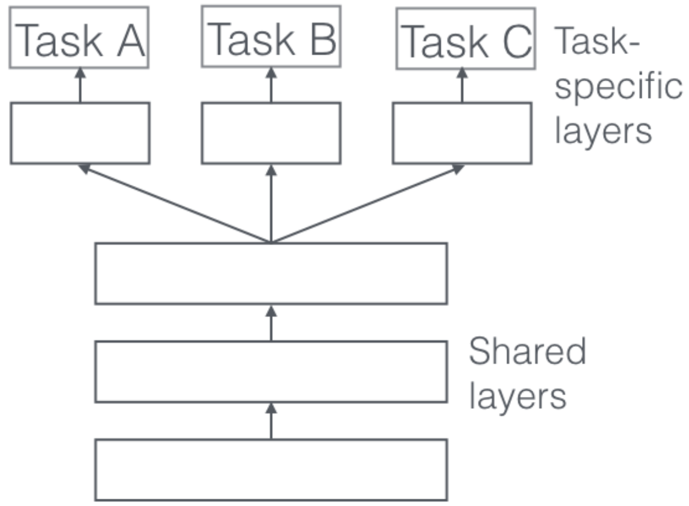
  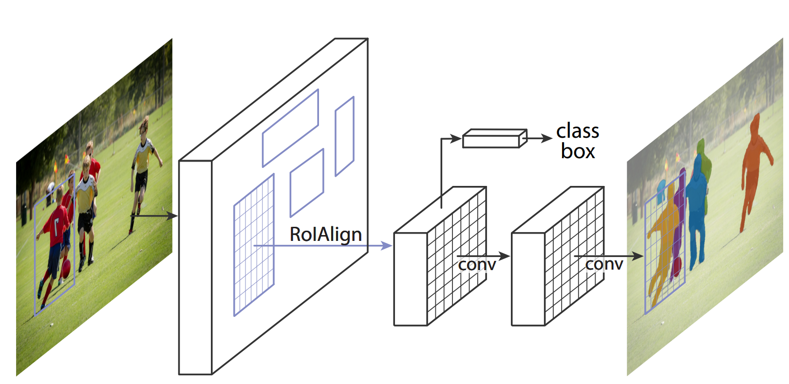

[1] [An Overview of Multi-Task Learning in Deep Neural Networks](https://arxiv.org/pdf/1706.05098.pdf)

[2] [Mask R-CNN](https://arxiv.org/pdf/1703.06870.pdf)

### Self-supervised Learning

Self-supervised learning (SSL) aims at training the model from the annotations generated by itself with no additional human effort.

  
  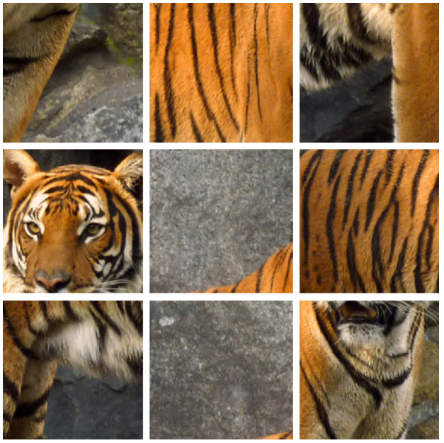

[3] [Learning Representations for Automatic Colorization](https://arxiv.org/pdf/1603.06668.pdf)

[4] [Unsupervised learning of visual representations by solving jigsaw puzzles](https://arxiv.org/pdf/1703.06870.pdf)

### Annotation Reuse
Reusing labels of one task is not only helpful to create new tasks and their labels but also capable of improving the performance of the main task through pretraining. 
Our work focuses on recycling bounding box labels for object detection.

  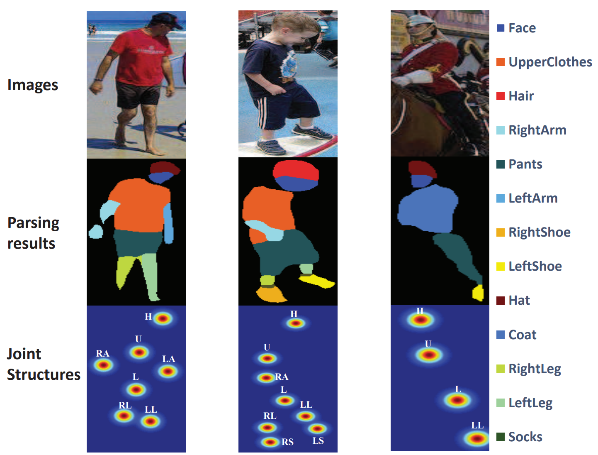
  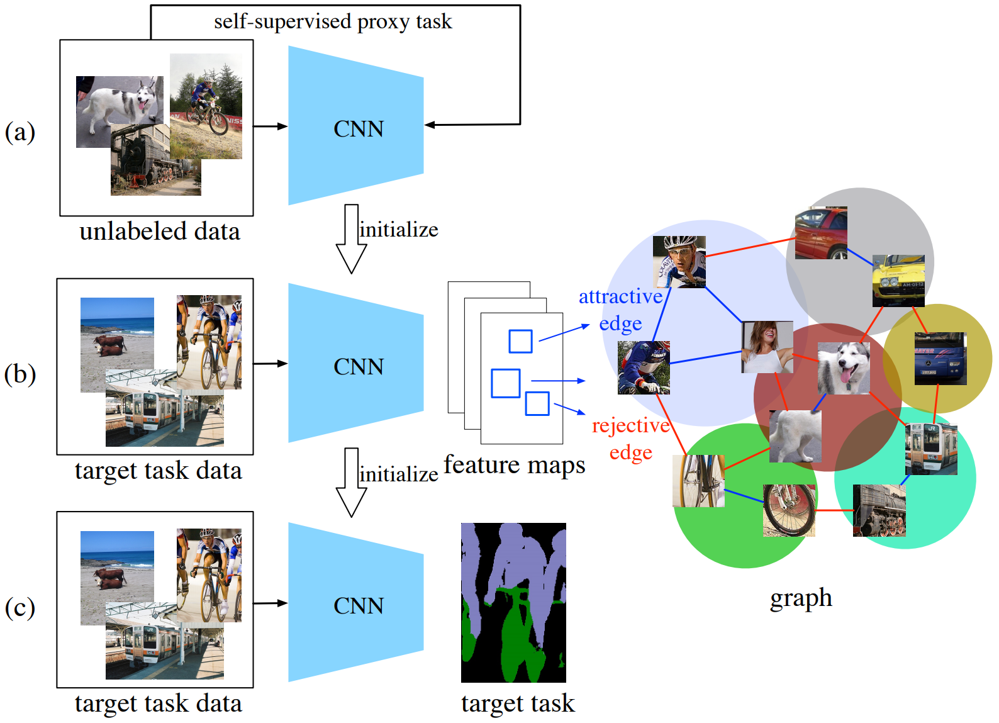

[5] [Look into Person: Self-supervised Structure-sensitive Learning and A New Benchmark for Human Parsing](https://arxiv.org/pdf/1703.05446.pdf)

[6] [Mix-and-Match Tuning for Self-Supervised Semantic Segmentation](https://arxiv.org/pdf/1712.00661.pdf)

### Our approach

The key to our approach is to propose a set of auxiliary tasks that are relevant but not identical to object detection. 
They create their own labels by recycling the bounding box labels (e.g. annotations of the main task) in an SSL manner while regarding the bounding box as metadata. 
Then these auxiliary tasks are jointly trained with the object detection model in an MTL way.

## Approach

### Overall architecture

  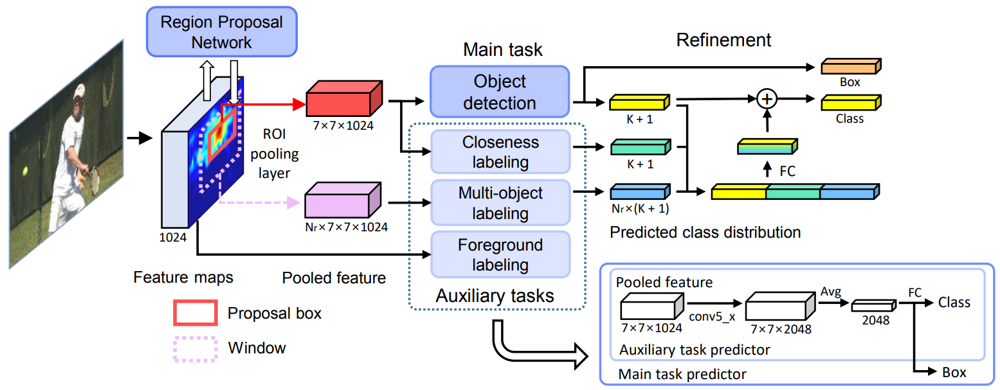

It shows how the object detector (i.e. main task model) such as Faster R-CNN makes a prediction for a given proposal box (red) with assistance of three auxiliary tasks at inference.
The auxiliary task models (shown in the bottom right) are almost identical to the main task predictor except no box regressor.
The refinement of detection prediction (shown in right) is also collectively done by cooperation of the main and auxiliary task models.
K is the number of categories.

### 3 auxiliary tasks

  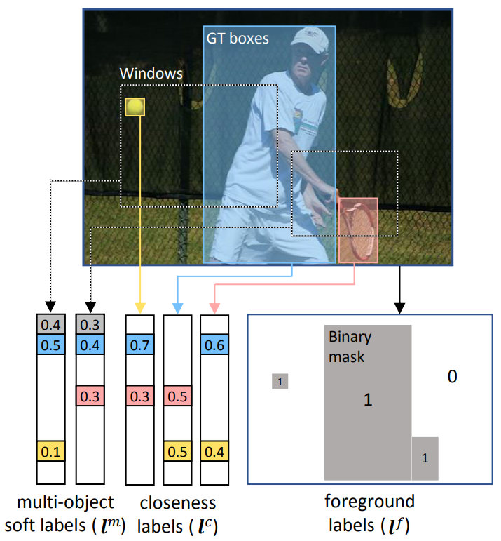

This is an example of how to generate labels of auxiliary tasks via recycling of GT bounding boxes.

* The multi-object soft label assigns the area portions occupied by each class’s GT boxes within a window.
* The closeness label scores the distances from the center of the GT box to those of other GT boxes.
* The foreground label is a binary mask between foreground and background.

## Results
We empirically validate that our approach effectively improves detection performance on various architectures and datasets.
We test two state-of-the-art region proposal object detectors, including Faster R-CNN and R-FCN,
with three CNN backbones of ResNet-101, InceptionResNet-v2, and MobileNet on two benchmark datasets of PASCAL VOC and COCO.

  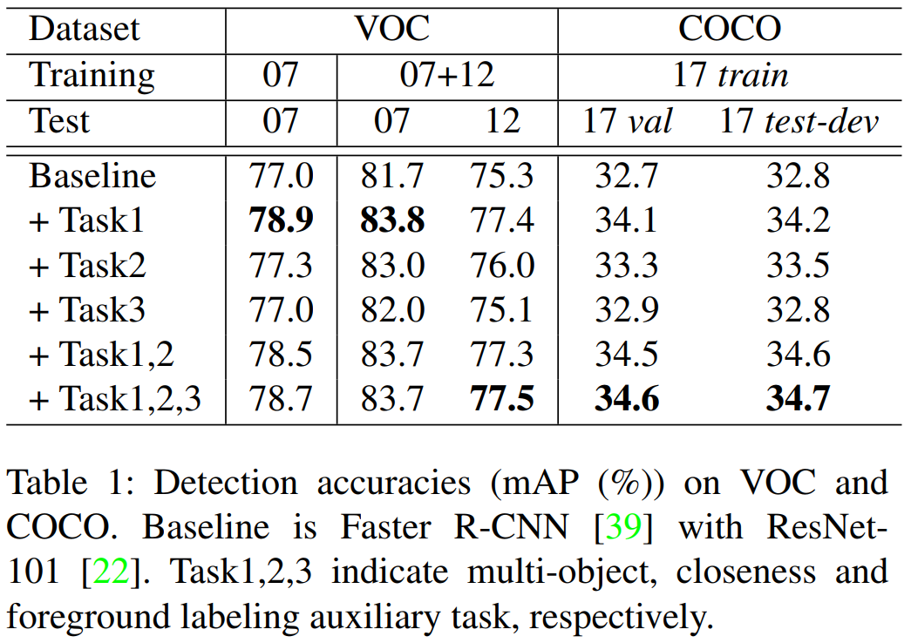
  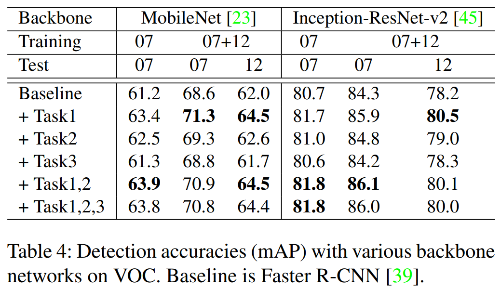

  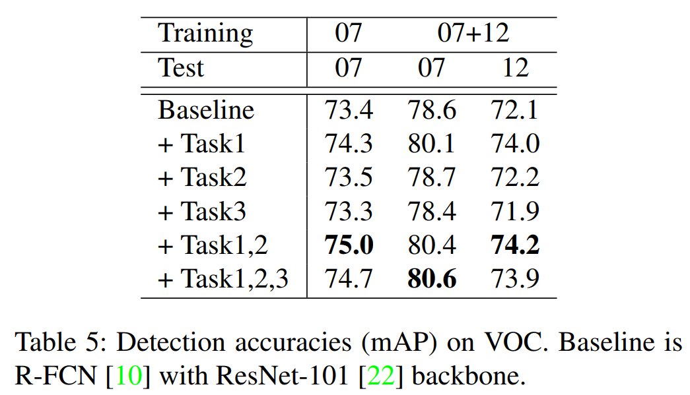
  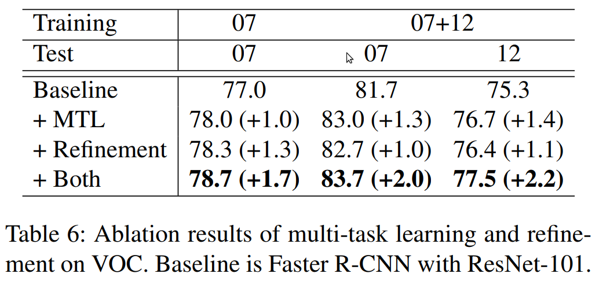

## Qualitative results

Qualitative comparison of detection results between baseline (left) and our approach (right) in each set.
We divide the errors into five categories (Localization, Classification, Redundancy, Background, False Negative).
Our approach often improves the baseline’s detection by correcting several false negatives and false positives such as 
background, similar object and redundant detection.

  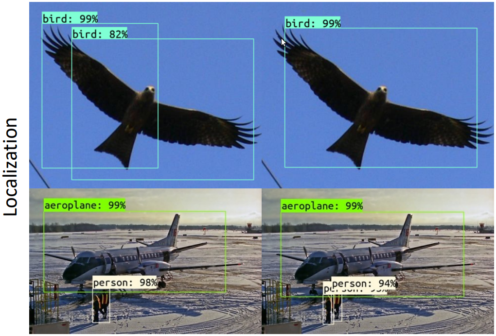

  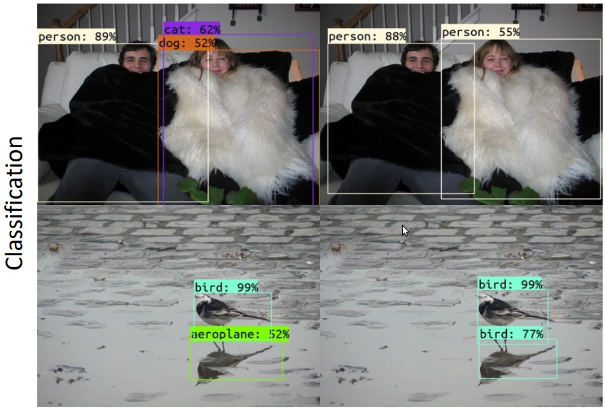

  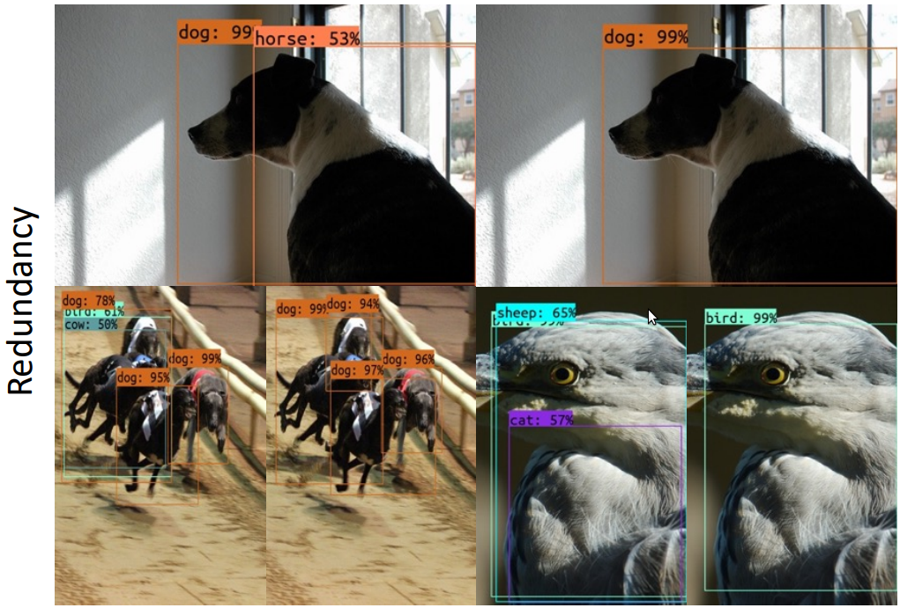

  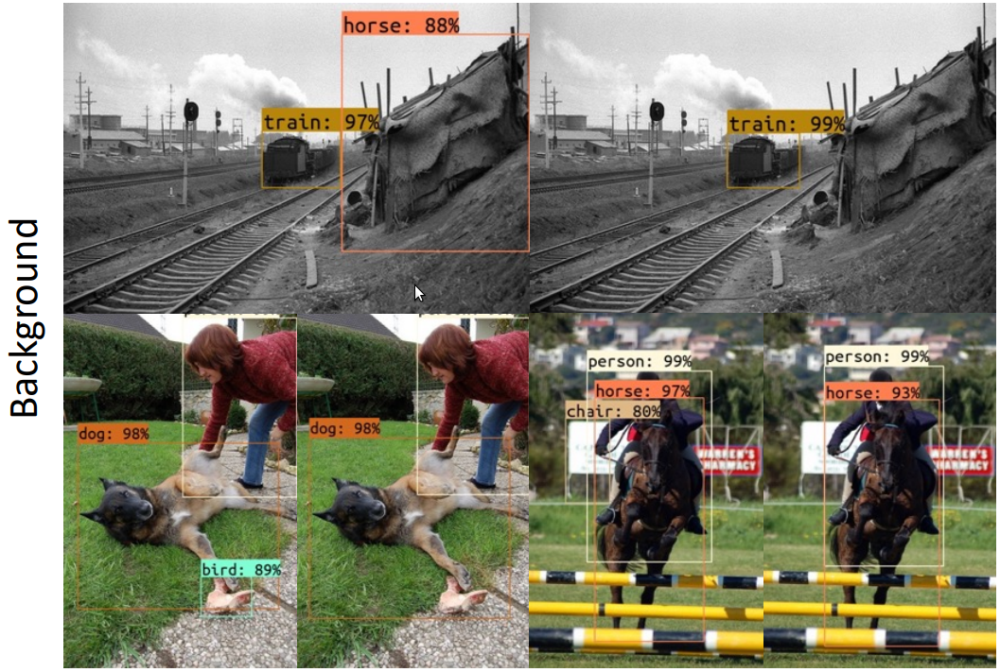

  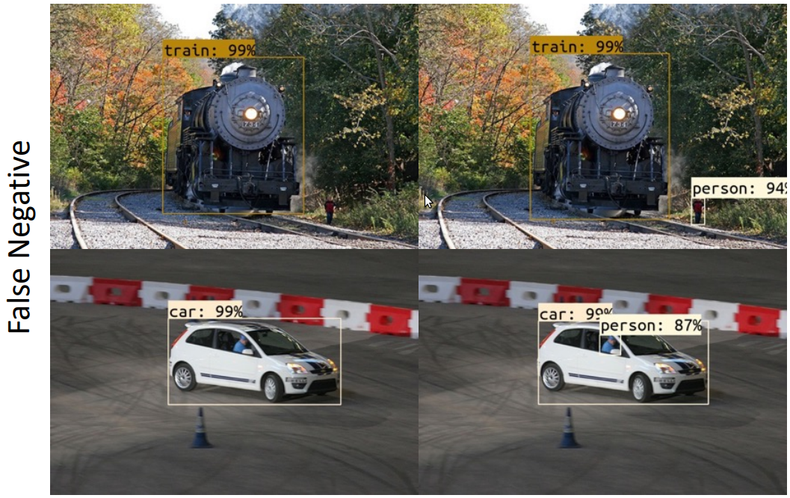

